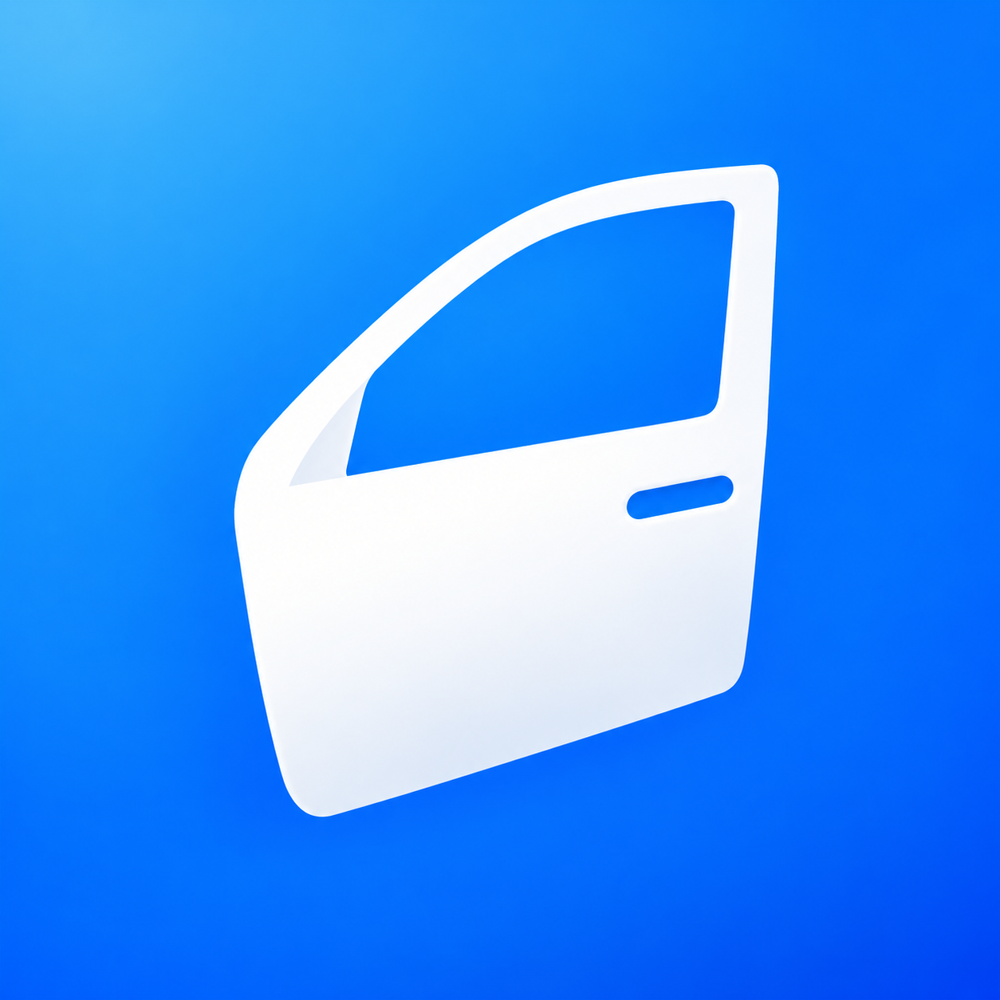
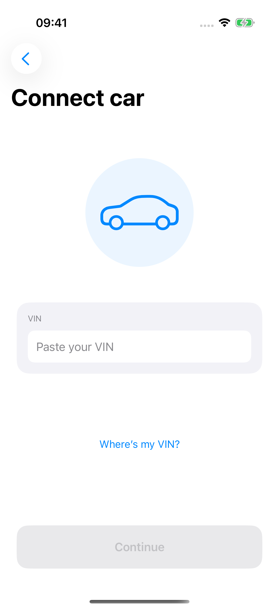
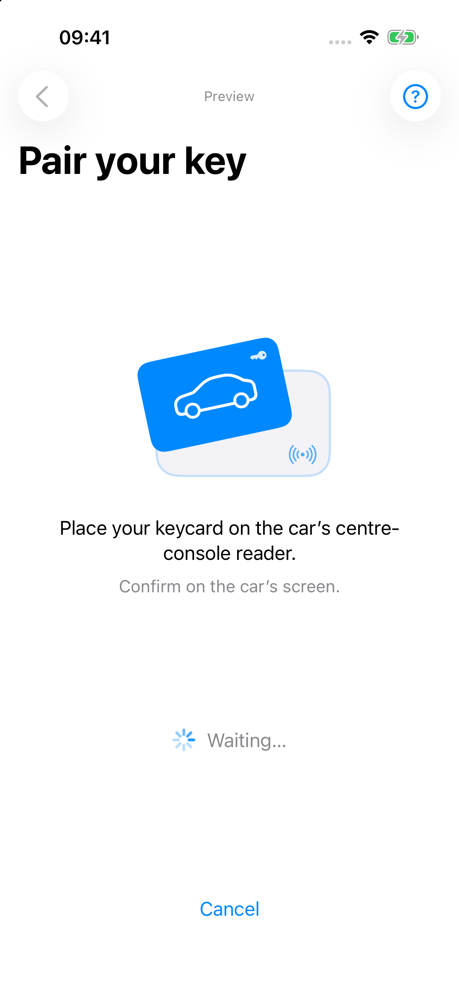
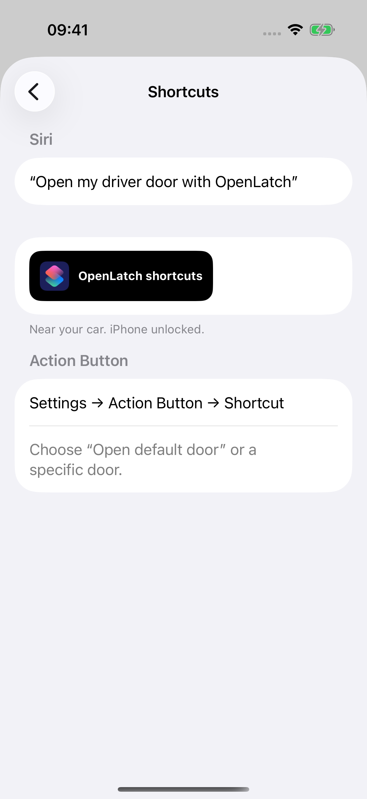
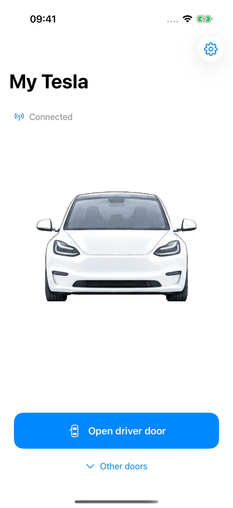

<div align="center">
  
  <h1>OpenLatch</h1>
  <p><strong>Your Tesla door. One tap, one shortcut, or one Siri request away.</strong></p>
  <p>A focused iPhone app for releasing a chosen door over local Bluetooth.<br>Built with SwiftUI. No Tesla login, command backend or analytics.</p>
  <p>
    <a href="LICENSE"></a>
    
    
    
  </p>
  <p><a href="#get-started">Get started</a> · <a href="docs/README.md">Documentation</a> · <a href="CONTRIBUTING.md">Contribute</a> · <a href="https://github.com/thomasgregg/openlatch/issues">Report an issue</a></p>
</div>

---

## Why OpenLatch?

Unlocking your Tesla leaves the door latched: you still need to operate the exterior handle. Sometimes you want to release the latch directly—when a handle is awkward to use, when helping a passenger get in, or when you want a familiar voice command or button to do the job.

Tesla’s app includes an **Unlatch Door** quick control for the **driver door**, as described in [Tesla’s owner’s manual](https://www.tesla.com/ownersmanual/model3/en_co/GUID-F907200E-A619-4A95-A0CF-94E0D03BEBEF.html). OpenLatch builds the experience around **choosing the door you want**: driver, front passenger, rear driver-side or rear passenger-side, with a saved default for each car and dedicated Siri and Shortcuts actions.

Choose the passenger door for someone getting in, keep the driver door as your everyday default, or assign a specific car and door to your iPhone’s Action Button. Commands travel directly over nearby Bluetooth, with no Tesla login or command server.

## Features

Pair directly with the vehicle using an existing key card, then use the app, Siri, Shortcuts or a supported iPhone’s Action Button.

- **One tap, your preferred door.** Save a default per car, or choose another door for a single request.
- **Siri voice control.** Ask Siri to open your default door or a specific door with OpenLatch.
- **Apple Shortcuts.** Choose the car and door, then add OpenLatch actions to your own shortcuts.
- **Action Button.** Assign an OpenLatch shortcut to the Action Button on supported iPhones.
- **Multiple cars, separate keys.** Name your cars and switch between them without repeating setup.
- **Local Bluetooth.** Commands go directly from your iPhone to the nearby vehicle.
- **Native iPhone experience.** Light and dark appearance, Dynamic Type, VoiceOver labels and reduced-motion support.
- **English and German.** Interface, help, permission prompts and Siri phrases are localized.
- **Honest feedback.** A command acknowledgement is distinguished from confirmed door movement; ambiguous requests are never automatically retried.


## A closer look

<table>
  <tr>
    <td align="center"></td>
    <td align="center"></td>
    <td align="center"></td>
    <td align="center"></td>
  </tr>
  <tr>
    <td align="center"><sub>1 · Connect your car</sub></td>
    <td align="center"><sub>2 · Pair your key</sub></td>
    <td align="center"><sub>3 · Set up shortcuts</sub></td>
    <td align="center"><sub>4 · Daily use</sub></td>
  </tr>
</table>

<sub>App screenshots captured in simulator preview mode with sample cars.</sub>

## Get started

You’ll need a Mac with Xcode and Swift 6.2+, an iPhone running iOS 17+, a compatible nearby Tesla and its existing key card for pairing. The simulator supports UI previews; real Bluetooth requires a physical iPhone.

```sh
git clone https://github.com/thomasgregg/openlatch.git
cd openlatch
open OpenLatch.xcodeproj
```

1. Choose the **OpenLatch Preview** scheme to explore the app without a car.
2. To use Bluetooth, choose **OpenLatch**, select your signing team and bundle identifier, and run on an unlocked iPhone.
3. Enter the vehicle’s 17-character VIN and follow the car’s key-card authorization instructions.
4. Complete the guided door test, choose your default door, and set up Siri or Shortcuts.

See [Getting started](docs/getting-started.md) for car settings, other doors, shortcuts and troubleshooting. Build from source using the steps above; [TestFlight preparation](docs/testflight.md) explains how to prepare a TestFlight build.

## Siri, Shortcuts and the Action Button

OpenLatch provides five actions through Apple’s App Intents:

| Action | Door selection |
| --- | --- |
| **Open default door** | Uses the chosen car’s saved default; the generic **Open door** action also lets you edit the Door parameter |
| **Open driver door** | Driver door |
| **Open passenger door** | Front passenger door |
| **Open rear driver-side door** | Rear door on the driver’s side |
| **Open rear passenger-side door** | Rear door on the passenger’s side |

**With Siri:** say “Open my driver door with OpenLatch” or “Open my car door with OpenLatch” for your saved default. Each named-door action also has its own Siri phrase. With multiple configured cars, Siri asks which car to use unless your shortcut specifies one.

**With Shortcuts:** create a shortcut, add an OpenLatch action, and choose its **Car** and **Door** where available. Named-door actions keep their door selection; the default action follows the car’s saved preference.

**With the Action Button:** save your OpenLatch shortcut, then select it under **Settings → Action Button → Shortcut** on a supported iPhone.

Actions open OpenLatch and use device authentication. Commands connect to the nearby car over Bluetooth. See the [setup guide](docs/getting-started.md) for details.

## How it works

```text
iPhone / SwiftUI  →  local Bluetooth  →  signed VCSEC session  →  chosen door
```

OpenLatch uses CoreBluetooth and a vendored TeslaBLE client to establish signed vehicle-security sessions. A door action sends one selected `closureMoveRequest` field set to `OPEN`, then checks the selected door’s status. Door release is a different operation from unlocking the vehicle.

Keys and VINs stay in device-only Keychain storage while unlocked. Each car has its own key. Manage saved cars in the app and vehicle authorizations under **Controls → Locks** on the car.

Read [Bluetooth and security](docs/bluetooth.md) for the protocol, request lifecycle and key handling.

## For developers

Dependencies are vendored. The Xcode project is generated from `project.yml`; core logic can be tested independently:

```sh
swift test
```

The [development guide](docs/development.md) covers Bluetooth package tests, iOS unit/UI tests, preview launch arguments and the repository layout. Contributions to accessibility, localization, testing and vehicle validation are welcome; start with [CONTRIBUTING.md](CONTRIBUTING.md).

## Documentation

| Guide | Focus |
| --- | --- |
| [Getting started](docs/getting-started.md) | Pairing, everyday use, cars and shortcuts |
| [Development](docs/development.md) | Build, test and contribute |
| [Bluetooth and security](docs/bluetooth.md) | Protocol, privacy and key lifecycle |
| [Vehicle validation](docs/vehicle-validation.md) | Compatibility evidence and physical test checklist |
| [TestFlight preparation](docs/testflight.md) | Archive and TestFlight distribution |

## Credits and license

OpenLatch code is [MIT licensed](LICENSE). Its Bluetooth implementation builds on [swift-tesla-ble](https://github.com/shoujiaxin/swift-tesla-ble), Apple’s SwiftProtobuf runtime and Tesla’s published vehicle protocol. Local patches and dependency licenses are recorded in [Third-party notices](THIRD_PARTY_NOTICES.md); licenses are also available inside the app under **Settings → About → Licenses**.

OpenLatch is an independent project and is not affiliated with Tesla, Inc.
