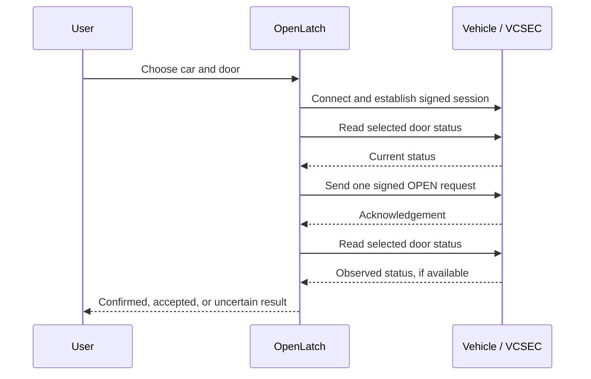

# Bluetooth and security

[← Documentation](README.md)

## Bluetooth implementation

`BluetoothVehicleService` uses the vendored TeslaBLE client with P-256 keys,
VIN-derived discovery, signed VCSEC sessions, and native CoreBluetooth transport.
Pairing sends one enrollment request and verifies authorization with a new signed
session. Normal operation negotiates only vehicle-security sessions.

Each action sets exactly one VCSEC `UnsignedMessage.closureMoveRequest` field to
`OPEN`: `frontDriverDoor`, `frontPassengerDoor`, `rearDriverDoor` or
`rearPassengerDoor`. Before signing, their respective payloads are `22 02 08 03`,
`22 02 10 03`, `22 02 18 03` and `22 02 20 03`. This is different from unlocking the vehicle.
The app reads the selected door's status before dispatch and after acknowledgement. A request is
never automatically retried: a timeout might mean the car already received it.
Acknowledgement without an open status shows **Request accepted. Check your door.**

## Request lifecycle

Core logic handles a door that is already open before dispatch. An acknowledgement is distinct from observed door movement. A timeout or lost connection can leave delivery ambiguous; the app does not automatically resend the command.

## Keys and authorization

Pairing creates a P-256 key and requests the vehicle’s **driver** role. That role permits more than the door-release operations exposed by the interface. Authorization requires the car’s approval using an existing key card.

Keys and VINs are stored in device-only Keychain storage, accessible while unlocked. Each car has its own key and setup state. Changing cars disconnects the previous connection; backgrounding the app disconnects Bluetooth. OpenLatch does not keep a passive phone key running.

Siri and Shortcuts actions open the app and require device authentication. Unknown or removed VINs never resolve to another car.

## Privacy

Vehicle commands travel over local Bluetooth. OpenLatch requires no Tesla account login and has no command backend or analytics. A new phone must pair again. To revoke access fully, delete the local key and its matching entry on the vehicle.
